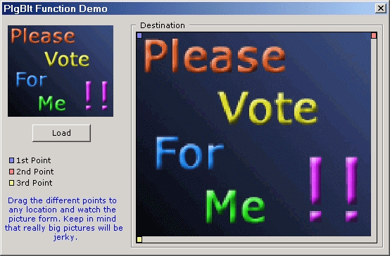



## PlgBlt Function \*\* Better Than BitBlt \*\*

### Description

Forget BitBlt! Shows how to use the PlgBlt function (Parallelogram Blit - Blitting to any shape rectangle you can think of!). It can do everything BitBlt can do and more! I think this funtion is only for NT/2000 haven't tested it on 98/Me. You can easily flip and rotate a picture with just one line of code! Every single line in fully commented so you can understand what is going on. It is hard to find examples of this function anywhere (search the internet, I dare you!)
 
### More Info
 
All in tha' ZIP

Think it is only for NT/2000

Returns - User back to PSC to vote!! =]

Extreme pleasure!

             |
---                |---
**Submitted On**   |2000-12-26 06:50:50
**By**             |[Brent Douglas](https://github.com/Planet-Source-Code/PSCIndex/blob/master/ByAuthor/brent-douglas.md)
**Level**          |Intermediate
**User Rating**    |4.3 (26 globes from 6 users)
**Compatibility**  |VB 6\.0
**Category**       |[Graphics](https://github.com/Planet-Source-Code/PSCIndex/blob/master/ByCategory/graphics__1-46.md)
**World**          |[Visual Basic](https://github.com/Planet-Source-Code/PSCIndex/blob/master/ByWorld/visual-basic.md)
**Archive File**   |[CODE\_UPLOAD1305012262000\.zip](https://github.com/Planet-Source-Code/brent-douglas-plgblt-function-better-than-bitblt__1-13868/archive/master.zip)

### API Declarations

All in tha' ZIP

